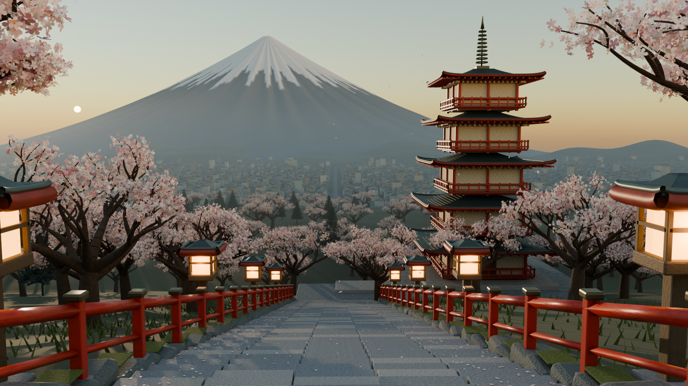

# Arakurayama — First Light

新倉山淺間公園春日清晨的可編輯 Blender 場景。以提供的照片作建築與季節參考，第五張圖作構圖參考；步道與燈籠配置為藝術化重組，並非實地測繪還原。



本次靜幀為 1920×1080、96 samples，使用 Cycles / Metal 實際渲染。原始檔為 [arakurayama_sunrise.blend](arakurayama_sunrise.blend)。

[觀看 12 秒動態預覽（MP4，640×360 / 8 fps）](renders/first_light_preview.mp4)

## 內容

- 五層忠靈塔：曲面出簷、朱紅構架、欄杆、屋面接縫、相輪。
- 下降石階、石砌邊牆、朱紅欄杆、暖色燈籠與落花。
- 四組共用櫻花樹網格、Geometry Nodes 微風、常綠樹與草叢。
- 富士吉田市街、山麓、具有放射狀溝紋與積雪的富士山。
- Cycles、AgX、清晨方向光、局部山谷薄霧。
- 24 fps、288 格（12 秒）攝影機推進與 90 片獨立花瓣動畫。

`arakurayama_sunrise.blend` 為主要成果。第 288 格為主視覺。模型、材質與動畫由程式生成，不需要外部貼圖或模擬快取。

## Headless 環境

使用 Python 3.11 與 Blender 4.5.3 的官方 `bpy` Python 模組。此專案的執行環境位於 `.venv`；建場與渲染均不啟動桌面視窗。

```sh
python3.11 -m venv .venv
.venv/bin/python -m pip install -r requirements.txt
```

`requirements-lock.txt` 記錄本次已驗證的完整套件版本，可替代 `requirements.txt` 用於重現環境。

在專案目錄執行：

```sh
# 重建完整場景並產生低解析度預覽
.venv/bin/python scripts/build_scene.py --render preview

# 只重建 .blend
.venv/bin/python scripts/build_scene.py --render none

# 檢查開頭、中間與結尾構圖
.venv/bin/python scripts/render_scene.py --preset preview --frames 1,144,288

# 2560 px / 192 samples 主視覺
.venv/bin/python scripts/render_scene.py --preset still --frames 288

# 1920 × 1080 動畫 PNG 序列；可分段執行或重算缺格
.venv/bin/python scripts/render_scene.py --preset animation --start 1 --end 288

# 多層 scene-linear EXR
.venv/bin/python scripts/render_scene.py --preset still --frames 288 --exr

# 低解析度動態預覽
.venv/bin/python scripts/render_scene.py --preset animatic --start 1 --end 288 --step 3 --samples 8
python3 scripts/encode_preview.py

# 驗證五層塔、攝影機框內位置、花瓣位移、外部貼圖依賴
.venv/bin/python scripts/validate_scene.py
```

也可使用已有 Blender 執行檔：

```sh
blender --background --python scripts/build_scene.py -- --render preview
blender --background --python scripts/render_scene.py -- --preset still --frames 288
```

macOS 執行時會偵測 Metal；不支援時使用 CPU。可在渲染指令加入 `--device CPU`。如受限沙箱造成原生 USD 元件初始化崩潰，需要在正常終端或已允許的執行環境使用上述命令。

動態預覽使用 640×360、8 fps（24 fps 場景每三格取樣一次），共 96 張實際 Cycles 渲染影格，長度 12 秒。它供檢視鏡頭、花瓣和微風節奏；完整 24 fps 高畫質序列可使用 `animation` 預設另行渲染。

## 輸出與編輯

- `scripts/build_scene.py`：固定亂數種子、完整場景建置原始碼。
- `scripts/render_scene.py`：預览、靜幀、動畫與 EXR 品質設定。
- `scene_manifest.json`：實際建場版本、物件數與資產說明。
- `validation.json`：儲存場景的自動檢查結果。
- `QA.md`：已執行的檢查、本版定位與後續精修方向。
- `renders/`：實際渲染成果；各渲染批次附 `render_log.json`。
- `scripts/encode_preview.py`：確認 96 格齊全、編碼 MP4，並檢查解析度、fps、影格數與時長。

完整動畫序列完成後可編碼：

```sh
ffmpeg -framerate 24 -start_number 1 -i renders/frames/frame_%04d.png -c:v libx264 -crf 18 -pix_fmt yuv420p -movflags +faststart renders/first_light.mp4
```

這是程序建模的場景初版。最終作品集精修仍可提升屋面細節、植物品種與樹形、石材微觀層次、市街的地域特徵；目前不宣稱是攝影測量或寫實掃描資產。
